# Making the NPC "See"

1. Add a AIPerception Component to the AI Controller

    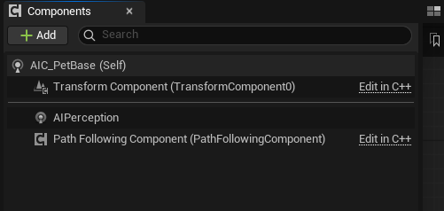

2. Set:
    - Dominant Sense : AISense Sight
        - If there are multiple senses, it will prioritize the AI Sense Sight's location

    - Senses Config: AI Sight Config
        - Sight Radius: The radius of how far it can see
            - Set: 800
        - Looe Sight Radius: The radius of how far it will need to be to be considered loosing sight
            - Set: 1200
        - PeripheralVisionHalfAngleDegrees: Degrees are counted for each eye
            - 90 Degrees X 2 = 180 Degrees
            - Set: 60
        - Max Age: After the enemy see something and the object is out of side, how long should it remember it for
            - Set: 5 (seconds)
        - Detection by Affiliation
            - Detect Enemies : True
            - Detect Neutrals : True
            - Detect Friendlies : True
    

# Switch Between States

1. Create a function called "Get Current State" in the AI Controller

    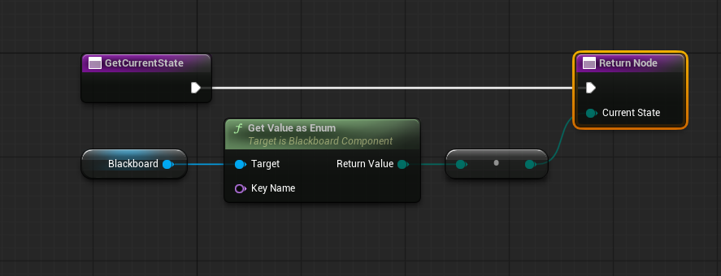

2. Create a function called "Set Current State" in the AI Controller 

    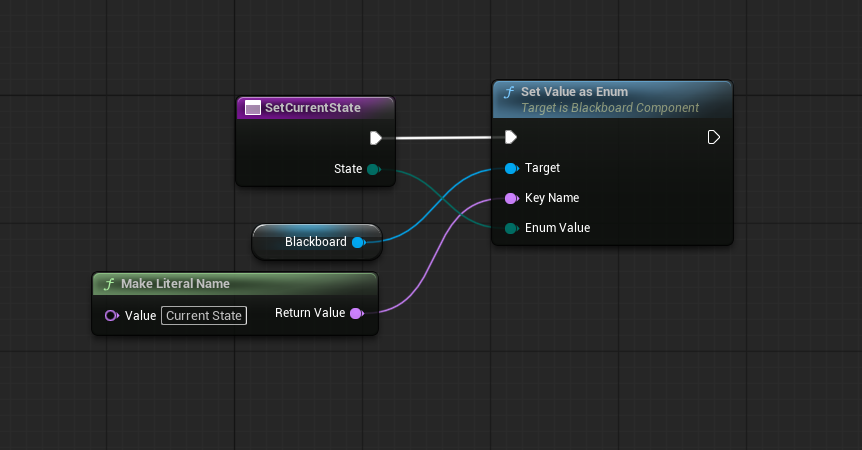

3. Create a function called "Handle Sense Sight" or other senses to set the state

    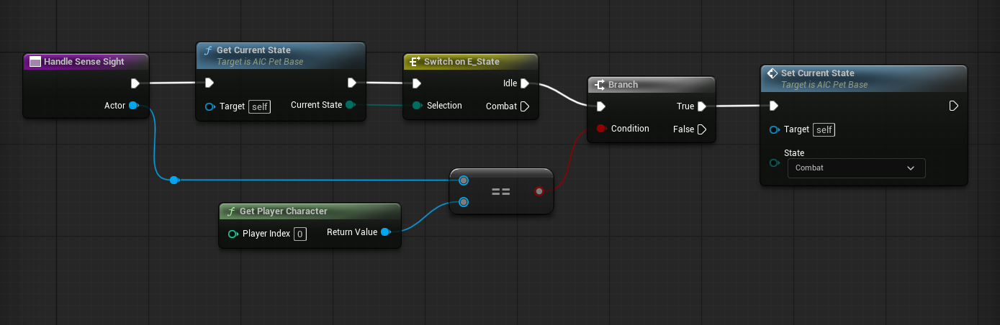

4. Use it in the "On Perception Updated"

    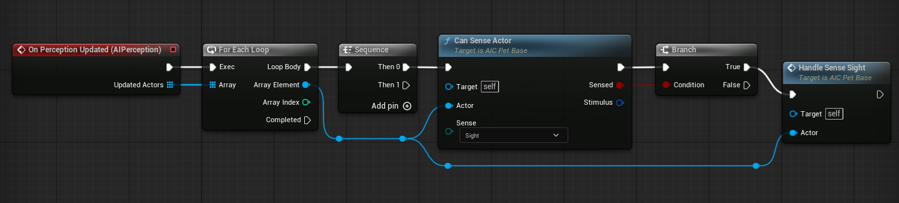

# Test

    Note: Using the Debugger
    
    Press the [ ' ] (single quote) key when you run the game and press the numeric keys to check the distance

    If you do not have a numpad, go to Edit → Project Settings → Gameplay Debugger, and set the number keys

    1. Create a new Enumeration
        - Name: E_AISense
            - Add Enumerator
                - None
                - Sight
                - Hearing
                - Damage

    2.  Open the AI Controller BP
        - Create a function:
            - Name: CanSenseActor
                - Inputs:
                    - Actor (Actor)
                    - Sense (E_AISense)
                - Outputs:
                    - Sensed (Boolean)
                    - Stimulus (AIStimulis)

        - Connections:

            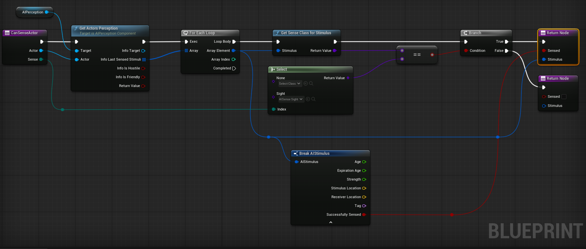

    3. Select the AIPerception component, in the details panel under "Events" 
        1. Click the "+" button for On Perception Updated
            - This event is called when it detects anything on any senses
            - Connections:
                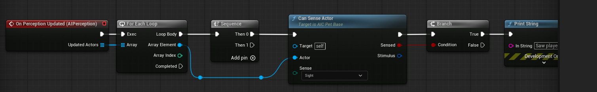

# Using EQS

1. Creaate an Enviroment Query
    - Right Click > Artificial Inteligence > EnvironmentQuery
    - Name: EQS_Strafe
2. Create a Testing Pawn
    - Right Click > Blueprint > EQSTestingPawn
    - Open the EQSTestingPawn and set the Query Template to the Environment Query (e.g. EQS_Strafe)

    You should see something like this if you add the Grid and Distance tests

    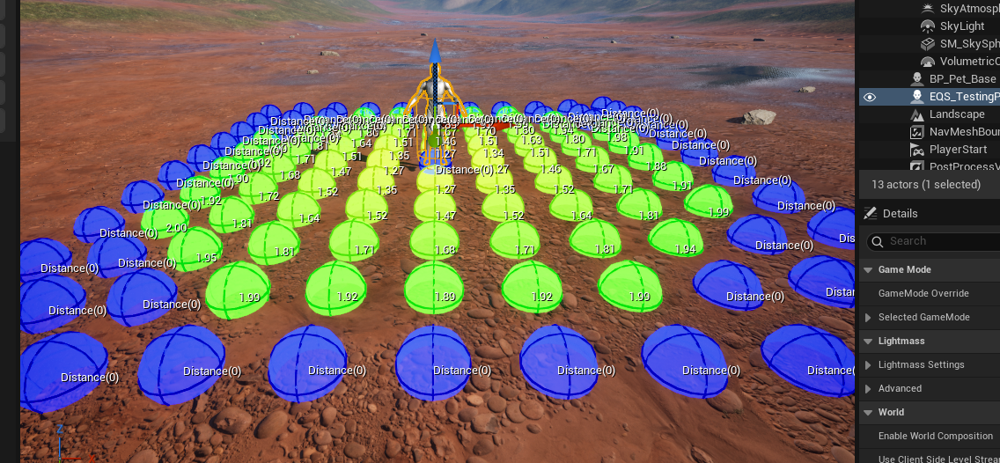

3. Create a EnvQueryContext_BlueprintBase

    This is used to determine where the points would spawn

    By default, the EQS will select the querier which means the person "querying" 

    - Name: EQS_Context_FollowTarget
    - Open EQS_Context_FollowTarget

        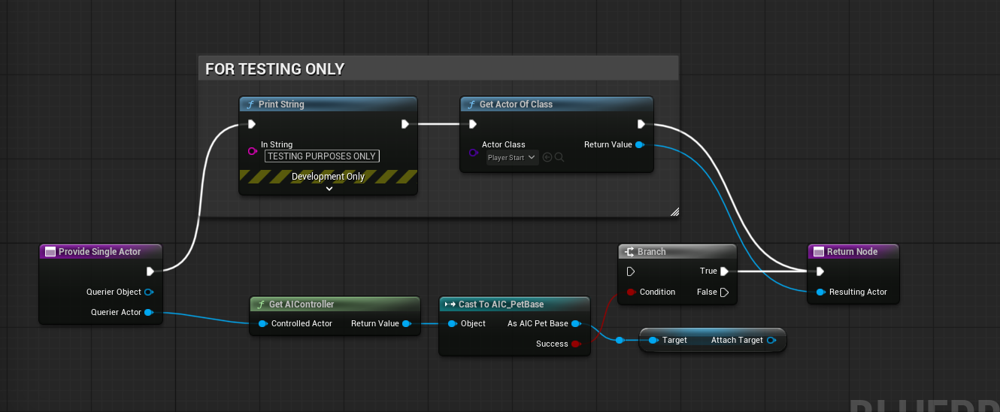

    
    Now set the query context with the EnvQueryContext_BlueprintBase you created in the EQS

    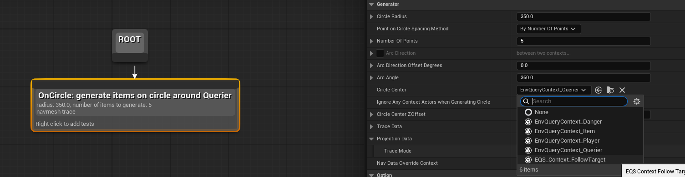

    You should see the points of the EQS spawn around the PlayerStart location when you select the EQS testing pawn.

    If he points do not show, you need to reposition the testing pawn or the player start.

    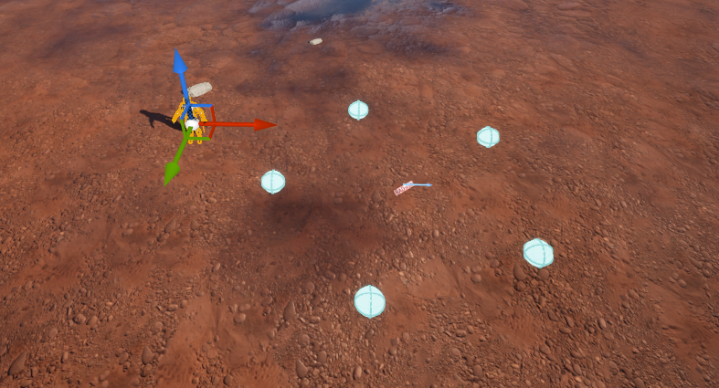

4. Testing the EQS, 

    - Add tests:
        - Pathfinding
    - Open the Behavior tree and execute the EQS, use the Run EQS Query 

        - Notable options

            - Query Template : Select the EQS you want to use

            - Run Mode : this represents what it should return 

                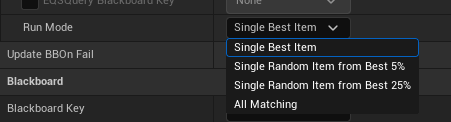

            - Blackboard Key : this represents the Blackboard variable that would store the data
                
                - Create a Vector3 variable in the Blackboard (e.g. PointOfInterest) and set it

                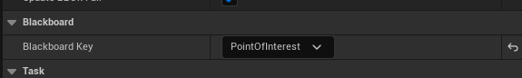
    
        - Behavior Tree

            - After running the EQS Query which should return a point, use the Move To task to move to the point

            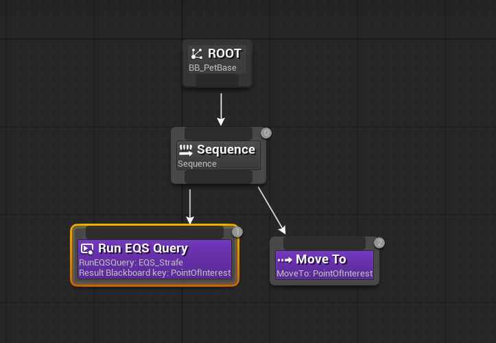

# EQS Cheat Sheet

## Find Point Near Player if the enemy is X Distance Away

1. In the EQS, use the tests:

    1. Pathfinding
    2. Distance
        - Distance To: Querier
        - Filter Type: Minimum
        - Float Value Min: X
       