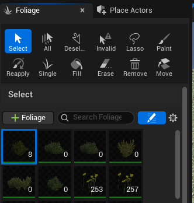

# Overview

Adding Foiliage to the level

# Activating the Foiliage Mode

1. Select the Foiliage mode option from the dropdown or (Shift + 3)

    

2. Drag and Drop meshes you want in the Foliage section

         

3. Select the Foliage you want by clicking on the checkbox to enable it when painting

    

4. Select the "Paint" mode and set the configuration for the brush

    

5. Paint on the level

    

# Adding Collision to the Foliage

1. Switch to "Select" mode while in "Foliage" mode (Shift + 3)
    
    

2. In the Details panel under, find Collision Presets and set the type of collision you want.

    

