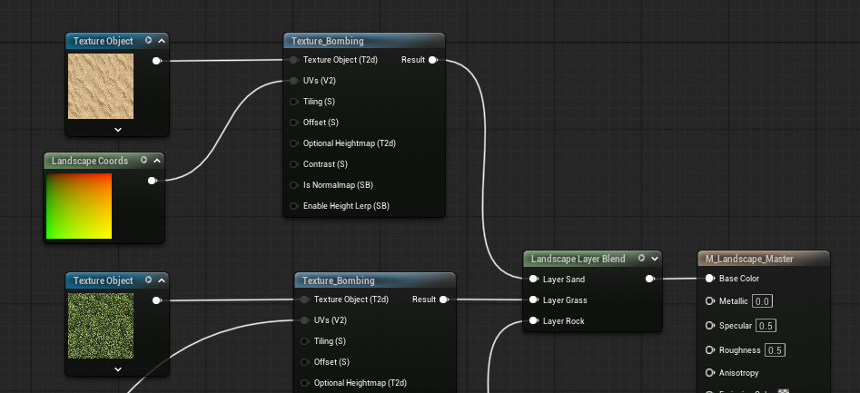

ok. Start over from the beginning and forget all history on this topic. 

In unreal engine 5, how can I create a custom landscape and a custom landscape material where I can paint multiple textures on it? Show me step by step and only move to the next step. 

For at least the first 3 steps would be, creating the landscape, creating the material file, and applying it to the landscape. 

Then it should be updating the material to achieve what I am asking. 

The landscape should contain 3 different textures, sand, grass, and rock.

Before you move to the instructions. Give me the grass, sand, and rock textures. Each should be separate files. Then after, give me the normal map images for the grass, sand, and rock, which should also be seprate files. 

 make no mistkes.

# Step 1: Creating the Landscape

1. Switch to Landscape Mode: In the top-left corner of the main viewport, locate the Modes dropdown menu (it usually defaults to "Selection"). Click it and select Landscape (or press Shift + 2). This changes the UI to display the landscape tools.

2. Manage/New Landscape: The Landscape panel will open on the left. Ensure you are in the Manage tab, and then select the New button below it.

3. Configure the Grid: You will now see a massive green grid in your viewport. In the Landscape panel, you have several options for creation:

    - Material: Leave this blank (None) for now, as requested. We will apply the material in Step 3.
    - Location/Rotation/Scale: These default to 0,0,0. This is good for now.
    - Section Size: The default 63x63 quads is standard and efficient.
    - Sections Per Component: Keep this at 1x1 Section.
    - Number of Components: A standard 8x8 grid will result in a 505x505 resolution landscape. This is a good, manageable starting size. If you want it larger or smaller, adjust these two numbers, but keep it modest for learning.

4. Create: Once you are satisfied with the grid configuration, click the green Create button at the bottom of the Landscape panel.

Unreal Engine will now generate the heightmap data and place a flat landscape actor into your level.

# Step 2: Creating the Material File

The objective here is simply to create the empty material asset in your Content Browser.

1. Open the Content Browser: Locate the Content Drawer at the bottom of the screen (or press Ctrl + Spacebar).

2. Navigate to your folder: If you have already created a folder for your terrain assets (like Materials or Environment), double-click to open it.

3. Right-Click and Create: In any empty gray space within the Content Browser, right-click.

4. Select Material: In the context menu that appears, under the Create Basic Asset category, click on Material.

5. Name the Material: A new material icon will appear with its name highlighted for editing. Name this material M_CustomLandscape.

You should now see the M_CustomLandscape asset sitting in your folder. It will have a default checkered sphere icon.

# Step 3: Applying the Material to the Landscape

The objective is to make the Landscape actor in your scene aware of the material we will build.

1. Select the Landscape: In your main viewport, click directly on the flat, gray checkered landscape grid you created in Step 1. You should see a yellow outline around it and the "Landscape" actor listed in your "Outliner" (top right of the screen).

2. Open the Details Panel: Look at the Details panel (usually on the bottom right of the screen, below the Outliner). This panel shows all the properties of whatever is currently selected.

3. Find the Landscape Material Slot: In the Details panel, scroll down until you see a category named Landscape. Below that, look for a specific property labeled Landscape Material.

4. Assign Your Material: There are two ways to do this:

    - Drag and Drop: Locate your M_CustomLandscape material in the Content Browser. Click and drag it directly from the Content Browser, and drop it into the none slot next to "Landscape Material" in the Details panel.

    - The Search Button: Alternatively, click the small search glass icon next to the slot, type M_CustomLandscape in the search box, and select it from the list.

5. Save Everything: Go to the main file menu and select File > Save All (or Ctrl + Shift + S) to save your level and the new material assignment.

The landscape may flash black briefly as it compiles, but it should return to its original state. The landscape material slot is now filled.

# Step 4: Initializing the Material and Importing Your Textures

The objective of this step is to open the Material Editor and import the six texture files you saved in Step 0 into that material.

1. Open the Material Editor: In your Content Browser, locate the M_CustomLandscape material asset. Double-click it. A new window, the Material Editor, will open. This is a visual scripting interface where we will use nodes to define the material's properties.

2. Locate your Textures: Minimize or move the Material Editor window slightly so you can see your Content Drawer (or Content Browser) and the folder on your computer where you saved the six images (image_0.png through image_5.png).

3. Import the Textures into the Content Browser:

    - Drag and Drop: Select all six image files from your computer folder (Ctrl + Click to select multiple). Drag them directly into an empty space within your Content Browser.
    - Unreal will import them as Texture assets. You will see six new icons (the original color images and the blue/purple normal maps).
    - Tip: It's good practice to rename these immediately (e.g., T_Grass_BC, T_Grass_N, etc.) but it is not strictly required for this process to work.

4. Place the Textures in the Material Editor:

    - Now, select the six newly created texture assets inside your Content Browser.
    - Drag all six of them together into the large, empty graph area of the Material Editor window.
    - Unreal will automatically create six Texture Sample nodes for you, each referencing one of your imported textures.

You should now see six square nodes floating in the Material Editor graph, connected to nothing, and one large, central Main Material Node (labeled "M_CustomLandscape") with many inputs (Base Color, Metallic, Roughness, Normal, etc.).

# Step 5: Setting Up the Layer Blending Logic

The objective is to create two Landscape Layer Blend nodes and connect your textures to them. These nodes act as a dynamic switchboard for your landscape painter.

1. Identify Your Textures: Organize your six texture nodes into pairs:

    - Layer 1 (Grass): The Grass Base Color and Grass Normal.
    - Layer 2 (Sand): The Sand Base Color and Sand Normal.
    - Layer 3 (Rock): The Rock Base Color and Rock Normal.

2. Create the First Layer Blend Node (Base Color):

    - Right-click in an empty space near your Base Color textures.
    - Type LandscapeLayerBlend in the search box.
    - Select the node named Landscape Layer Blend (it is a long, dark node).

3. Define the Layers (Base Color):

    - With the new node selected, look at the Details panel on the left side of the Material Editor window.
    - Find the Layers property. You will see an empty array with an green + icon.
    - Click the green + (Add Element) button. A new entry, [0], will appear. Expand it.
    - Change the Layer Name to Grass.
    - Ensure Blend Type is set to LB Weight Blend. This is critical for painting.

4. Add the Remaining Layers (Base Color):

    - Repeat the process twice more, clicking the + button each time.
    - Name the second entry ([1]) Sand. Set its blend type to LB Weight Blend.
    - Name the third entry ([2]) Rock. Set its blend type to LB Weight Blend.
    - The Landscape Layer Blend node in your graph will now have three inputs: Layer Grass, Layer Sand, and Layer Rock.

5. Connect the Base Color Textures:
    
    - Drag a wire from the white pin (the RGBA output) of your Grass Base Color node.
    - Plug it into the input pin labeled Layer Grass on your LandscapeLayerBlend node.
    - Connect the Sand Base Color node to the Layer Sand input.
    - Connect the Rock Base Color node to the Layer Rock input.

6. Create and Configure the Second Layer Blend Node (Normal):

    - We must create an identical setup for the normal maps. Right-click on your configured Landscape Layer Blend node and select Duplicate (or Ctrl + D). Place the new node near your Normal Map textures.
    - The duplicate node already contains the correct layer definitions ("Grass", "Sand", "Rock") and blend types.

7. Connect the Normal Map Textures:

    - Drag a wire from the white pin (the RGBA output) of your Grass Normal node.
    - Plug it into the input pin labeled Layer Grass on the duplicate LandscapeLayerBlend node.
    - Connect the Sand Normal node to the Layer Sand input.
    - Connect the Rock Normal node to the Layer Rock input.

You should now have your six textures feeding into two massive Landscape Layer Blend nodes, which look like organized switchboards.

# Step 6: Completing the Material Connections

The objective is to finalize the material's internal wiring and save the asset.

1. Locate the Main Material Node: This is the large, central node with the many inputs (Base Color, Metallic, Roughness, Normal, etc.).

2. Connect the Base Color:

    - Find the single output pin on your first LandscapeLayerBlend node (the one where the Base Color textures are plugged into).
    - Drag a wire from that output pin.
    - Plug it into the Base Color input pin on the Main Material Node.

3. Connect the Normal:

    - Find the single output pin on your second LandscapeLayerBlend node (the one where the Normal Map textures are plugged into).
    - Drag a wire from that output pin.
    - Plug it into the Normal input pin on the Main Material Node.

4. Define Additional Properties (Optional but Recommended):

    - Currently, the terrain will be extremely shiny. It's a good idea to add a simple roughness value.
    - Right-click near the Roughness input and create a Constant node. (Or hold down the 1 key on your keyboard and click in the graph).
    - Set the Value of this constant to 0.9 (a high value means low shininess).
    - Plug this constant into the Roughness input pin on the Main Material Node.

5. Save and Apply:

    - In the top left of the Material Editor window, click the green Apply button. This compiles the shader code.
    - Then, click the yellow Save icon next to it.
    - You can now close the M_CustomLandscape Material Editor window.

You should now see that your flat landscape actor in the level viewport is no longer gray and checkered. It might turn black, which is expected before painting. The material is ready.

# Step 7: Creating Landscape Layer Info Assets

The objective is to generate the data containers for your three blendable layers: Grass, Sand, and Rock.

1. Switch to Landscape Mode (Again): In the main viewport, go back to the top-left Modes dropdown menu and select Landscape (or press Shift + 2).

2. Select the Paint Tab: In the Landscape panel on the left, click the Paint tab (it is next to "Manage" and "Sculpt").

3. Locate the Layers List: Look down the Landscape panel. You will see a sub-section named Layers.

    - Crucially, you should now see three entries listed here, corresponding exactly to the names you defined in your material's Landscape Layer Blend node: Grass, Sand, and Rock.

4. Create the 'Grass' Layer Info:

    - To the right of the Grass layer name, you will see a small + icon (Create Layer Info). Click it.
    - A small context menu will appear. Select Weight-Blended Layer (normal).
    - A "Save Asset As" window will pop up. Unreal will automatically name it something like Grass_LayerInfo and place it in your project's Game folder.
    - Confirm the name and click Save.
    - The icon next to "Grass" in the Landscape panel will change from a + to a small checkered sphere, indicating the Layer Info is now created and active.

5. Create the 'Sand' Layer Info:

    - Repeat the process for the Sand layer. Click the + icon next to Sand.
    - Select Weight-Blended Layer (normal).
    - Save it as Sand_LayerInfo.

6. Create the 'Rock' Layer Info:

    - Repeat the process for the Rock layer. Click the + icon next to Rock.
    - Select Weight-Blended Layer (normal).
    - Save it as Rock_LayerInfo.

7. Select a Default Layer:

    - Make sure that at least one of these layers (e.g., Grass) is selected in the list.

You should now see all three layers (Grass, Sand, Rock) in the Landscape panel, and each one should have its own corresponding Layer Info asset icon displayed next to it.

# Step 8: Painting the Multiple Textures

The final objective is to use the landscape paint tools to apply the Grass, Sand, and Rock textures to the landscape actor.

1. Enter Landscape Paint Mode:

    - Ensure you are still in Landscape Mode (Shift + 2) and have the Paint tab selected in the Landscape panel on the left.

    - You should see your three layers (Grass, Sand, Rock) listed under the "Layers" section.

2. Paint the Default Layer (Grass):

    - Select the Grass layer from the list. (It should be highlighted).
    - In the main viewport, you will see a large circular brush outline.
    - Hold down the left mouse button and drag across the entire landscape.
    - The entire terrain will be "filled" with your green Grass texture. This establishes your base layer.
    
3. Paint the Sand Layer:

    - Now, select the Sand layer from the list.
    - In the main viewport, find an area you want to be desert.
    - Adjust your brush settings in the Landscape panel:

        - Brush Size: (e.g., 2048) to cover larger areas.
        - Tool Strength: (e.g., 0.5) to blend softly.

    - Hold down the left mouse button and paint a path or a large patch of sand over the grass.
    - You should see the sand texture replace the grass texture where you painted, with a soft blend at the edges.

4. Paint the Rock Layer:

    - Next, select the Rock layer from the list.
    - Find an area you want to be rocky (e.g., a steep slope or a cliff face).
    - Adjust your brush size and strength as needed.
    - Hold down the left mouse button and paint the rock texture over both the grass and the sand.
    - You should now see all three textures—grass, sand, and rock—visible and blended together on your single landscape actor.

# Step 9: Enlarging the texture images

1. From the UVs pin of a TextureSample, drag out and search for LandscapeLayerCoords
2. Set Mapping Scale to 5 or whatever you want. This will enlarge the textures

--------------------------------------------------------------------------------------------------------------------------

# Texture Bombing

Texture Bombing is a procedural technique in Unreal Engine used to eliminate the repetitive "grid" pattern that occurs when a small texture is tiled over a large surface, like a landscape or a massive wall.

Instead of laying the texture down in a perfect, predictable grid, Texture Bombing "scatters" the texture randomly across the surface.

1. Use the Texture_Bombing node
    - Drag out the Texture Object pin and add a Texture Object node
    - Select the Texture Object node and set the Texture 
    - Drag out the UVs pin and add a LandscapeLayerCoord
        - Set the Mapping Scale (e.g. 5) to enlarge the texture
    - (Optionally) Set the Tiling 
2. Connect it to the Landscape Layer Blend node

