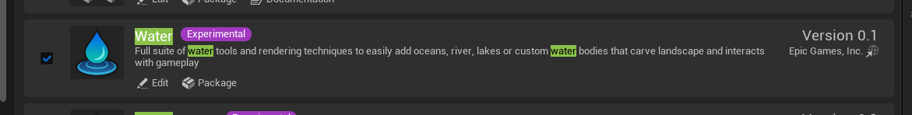
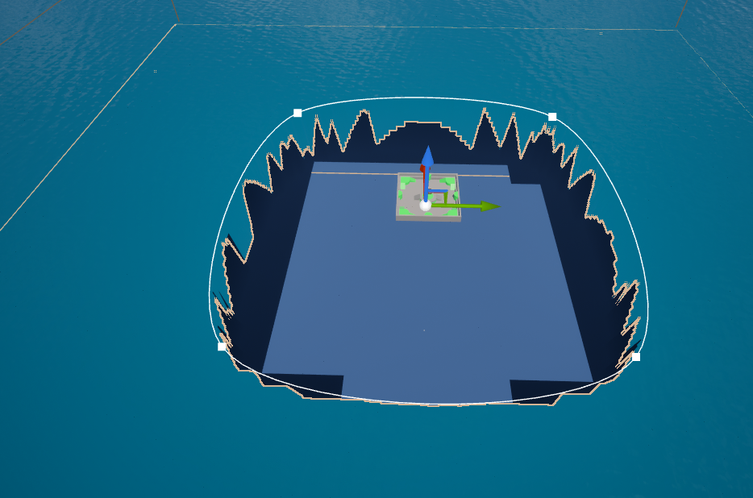

# Overview

Using the Water Plugin from Epic Games to add water to your map

# Enabling the Plugin

1. Go to Edit > Plugins
2. Search for "Water" and enable the Water plugin by Epic Games

    

# Add Water

1. Add a Water Body Ocean into the level

    

2. Adjust the 4 points of the Ocean to fit your map

    