# Overview

Amature is the group of bones.

# Hotkeys

## Add Amature / Bone

- Object Mode
    1. Shift + A > Amature

- Edit Mode
    - Add Bone
        1. Shit + A
    - Duplicate Bone
        1. Shit + D

## Parent Bones (Edit Mode)

1. Select a bone
2. Hold Shift and select the bones you want to group
3. Press CTRL + P > Keep Offset or Connected

    - Keey Offset couples the bone without connecting them together (keeps the would position) and is indicated via dotted line(s)
    - Connected will couple the bones together (combining them)

Results: You will see the dotted lines between the bones that indicates that they are linked and parented.

The first bone selected would be the child and the last one selected becomes the parent.

Another way to create Connected Bones is:

1. Subdivide
    1. Select the bone
    2. Right click > Subdivide
2. Extrude
    1. Select the head or tail of the bone and press (E)

## Transform (Edit Mode)

1. G
    - Move
2. R
    - Rotate
3. S
    - Scale

# Reset to Default Position (Pose Mode)

1. Select all or some bones
2. In the menu on the top, select "Pose" > "Clear Transform" > "All"

# Modes

1. Object
2. Edit
    - Create Bones
3. Pose
    - Move and test bone movement and connections

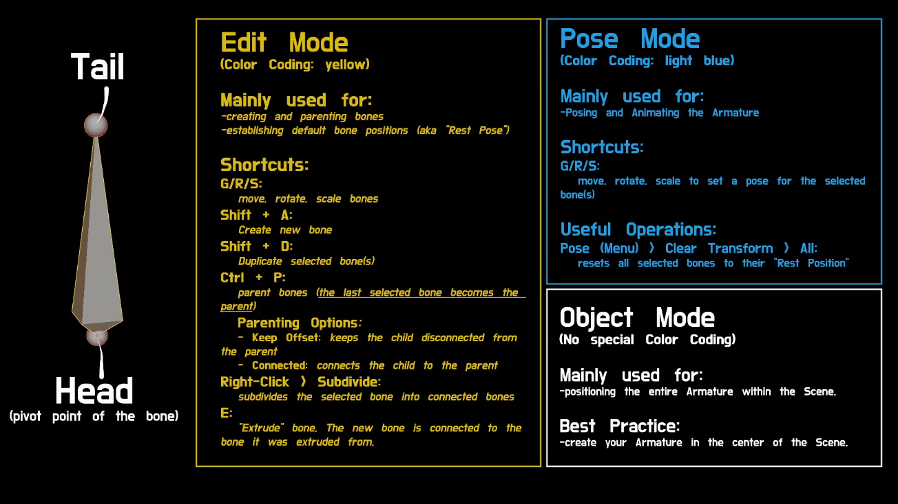

# Anatomy of Bone

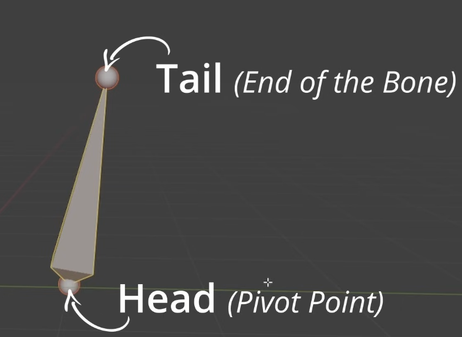

# Useful Settings

1. In Front
    - Displays the bones in front of the mesh / object

        - Select the bone / Amature
        - In the Side menu, select the "Amature" option > Viewport Display > Check "In Front"

    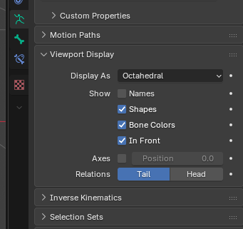

2. Tab to Switch Menus
    - Go to Edit > Preferences > Keymap > Tab for Pie Menu

# Symmetrize

1. Name the bones with ".L" or ".R" 
2. Select all the bones or bones you want to symmetrize
3. Right click and select "Symmetrize"

# Symmetrize Movement

1. Select the symmetrized bone
2. Click on the "X" button on the top right menu 
    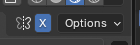

OR you can press "N" to turn on the right toolbar and select "Tool" > "Options" > X-Axis Mirror

# Bind Armature with Mesh

1. Select the Mesh
2. Select the Armature (Make sure to select the Armature last)
3. Press Ctrl + P > With Automatic Weights

# Constraints

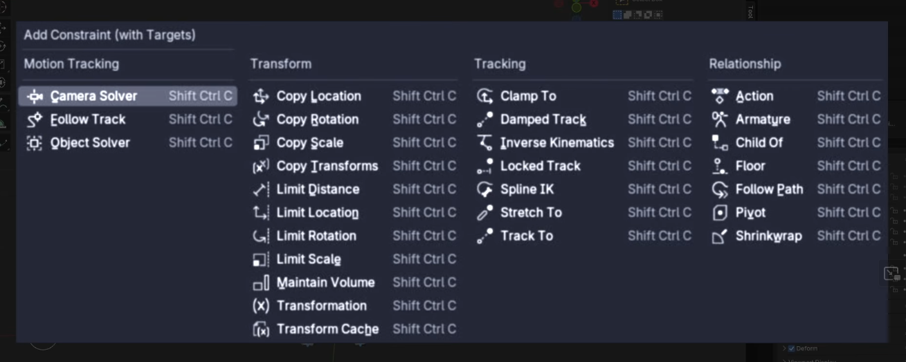

1. Inverse Kinematics

    - Go to Edit Mode
    - Add a Bone to move the IK'd bone
    - Select the Bone, 
        - Press Alt + P > "Clear Parent"
        - Press F2, rename to ik_target.L
    - Go to Pose Mode with the bone selected
    - Click on the "Bone Constraints" option on the menu on the right 

        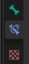

        Inverse Kinematics applies to the last bone you want to effect

    - Select the last bone and add the "Inverse Kinematics" constraint
        - Set:
            - Target: Armature (Gives access to the bone inside the Armature / target)
            - Bone: ik_target.L

        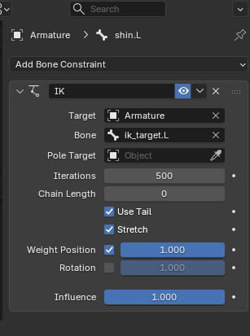

        Right now the IK effects the whole character. It is because "Chain Length" is set to 0, which means no limit on the chain.

        - Set Chain Length to 2 to effect 2 bones

        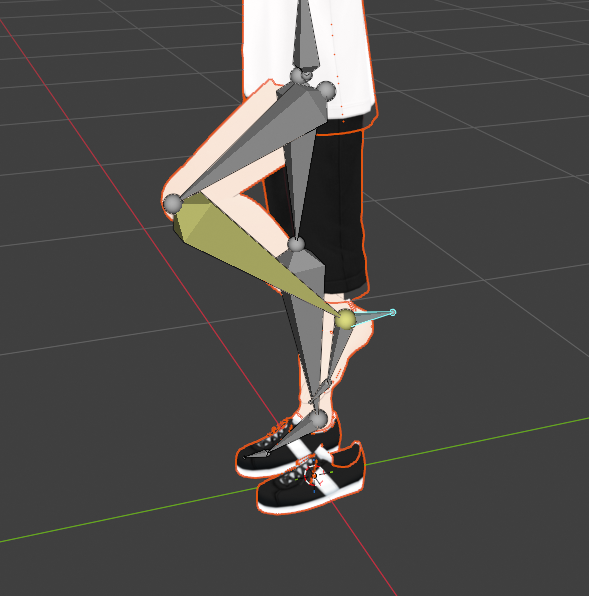

    
    1. Pole Target

        The Pole Target represents the direction of which the IK would face. Without itm the direction of how the bones face can move around.

        - Add a Bone between the effected bones
        - Select the Bone, 
            - Press Alt + P > "Clear Parent"
            - Press F2, rename to ik_pole.L
            - Move to bone outwards (the direction you want it to always face)
        
            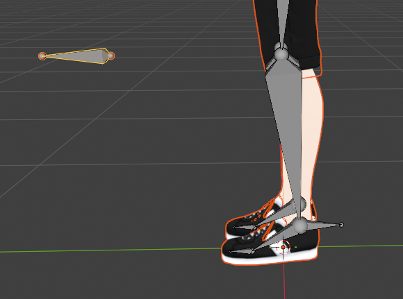
        
        - Select the bone with the IK Constraint and set the Pole Target and Angle to -90 or whatever to fix the default position of the character / object

            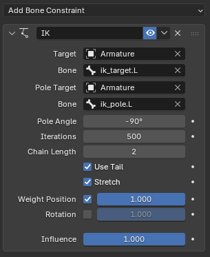

        

# Issues

## Foot Sinking

This is when the IK effects the foot and make it sink below the floor

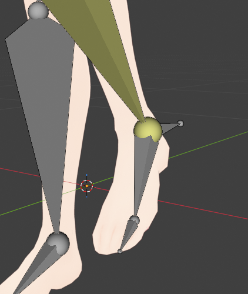

The fix:

1. Select the foot and the IK Target bone
2. Press CTRL + P > "Keep Offset"
    - This will bind the feet to the IK Bone
    - It will disconnect the connection to the ankle / shin with the foot bone
    - To fix this, select the foot bone
        - Switch to Pose Mode and navigate to the "Bone Constraint" menu

            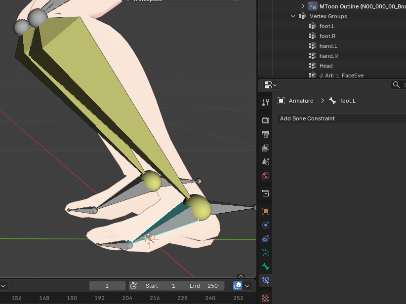
        
        - Add a "Copy Location" contraint so it will follow the location of the bone selected.

            - Set:
                - Target: Armature (this will give access to bones inside the armature)
                - Bone: shin.L
                - Head/Tail : 1 (1 is closer to the Tail of the target bone and 0 is closer to the head)

            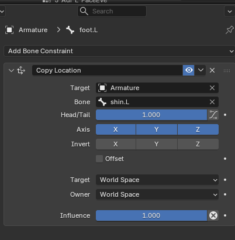

# Weight Painting

1. Go to Object Mode
2. Select the Armature
3. Press Shift + select the Mesh you want to weight paint
4. Switch to Weight Paint Mode (make sure automatic weights is set)
5. Set:
    - Blend to "Add"
    - Options:
        - Auto Normalized: Checked
    - Symmetry (Completely Symetical Mesh) (Disables these if not)
        - Mirror Vertex Groups: Checked
        - Mirror: [X] [-] [-]
    
    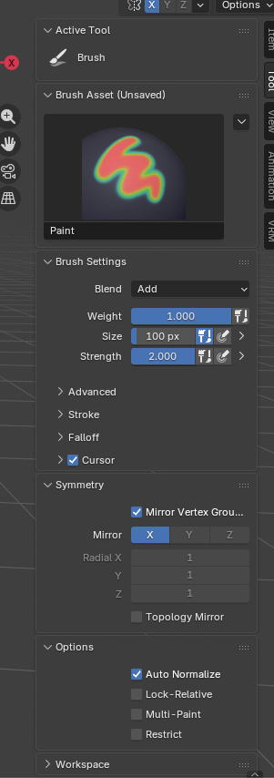

To Paint, Press Alt + Click 
To Subtract Weights, Press Ctrl + Click

# Root Bone

The Root bone is used to move the whole character.

1. Switch to Edit Mode
2. Reset the origin point (cursor)
    - Shift + S > Cursor to World Origin
3. Press Shift + A to add a bone
4. Name and resize the bone (make it smaller)
5. Parent all the bones that is not connected to the root
    - Press Ctrl + P > Keep Offset

# Disable Deform for Non-related bones

Sometimes we may want to disable the "Deform" settings for the bone so it does not effect the mesh. 

This is usefule for the IK bones or root as we do not want the mesh to be modified based on it.

To get to the option, select the bone, click on the "Bone" icon on the right toolbar and uncheck "Deform"

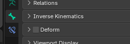

# Bone Shapes

Bone Shape replaces the bones with a Shape

1. Go to the Object Mode and add a Circle
    - Press Shift + A > Mesh > Circle

        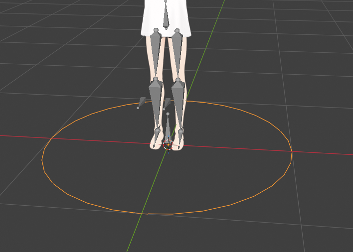

    - Press F2, name it

2. Select the Bone and Set the Circle as the Bone

    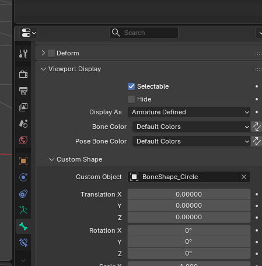

